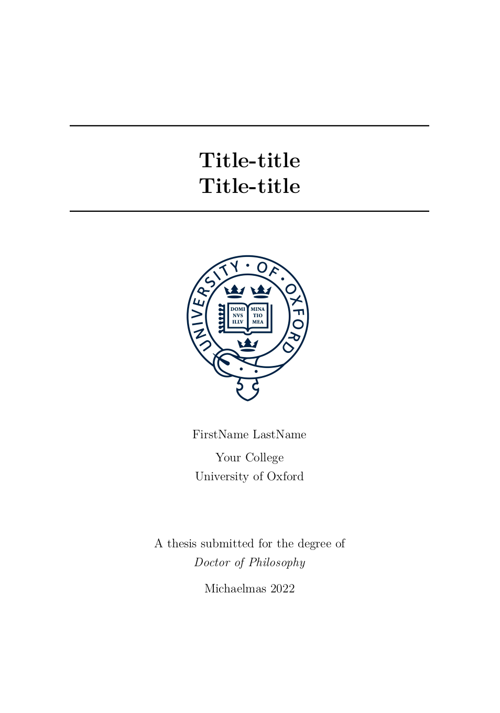

# Oxford Integrated Thesis Template

### What is integrated thesis?
[Integrated thesis](https://www.mpls.ox.ac.uk/graduate-school/information-for-postgraduate-research-students/submitting-your-thesis)
is a thesis format accepted by some doctoral programmes in Oxford University.
It could *include scientific papers as thesis chapters*.

### What is this template?
The key function is to group your papers (e.g. your latex source from arXiv) 
into a single thesis file with minimal modification.
The template is designed to:
1. Keep the references (e.g. tables and figures) in each paper directory.
2. Fix the bibliography from multiple sources. 

### Instructions
* Copy paper directories into `chapter/`, e.g. `chapter/paper1/`.
* Remove the preamble and the bibliography in the paper tex file, let it start from `\title{}`. See `chapter/paper1/main.tex` for example.
* Import the paper tex file in `chapter/papers.tex`, by declaring their relative paths.
* Add the additional bib source (for your paper) in `def.tex` or `main.tex`.
* (optional) Use `vgg_bibtex/group_bib.py` script to remove duplicate bibliography items.
* Compile `main.tex`.

### Acknowledgement
This template is originally developed for my own thesis.
You are welcomed to use it for your work, but at your own risk.
It might be built on other great open-sourced thesis templates:
* https://www.oxfordechoes.com/oxford-thesis-template/
* https://github.com/mcmanigle/OxThesis
* https://github.com/twgr/thesis

The bibliography part in `def.tex` is Shangzhe Wu's contribution.

### Contact
Email me (Tengda Han, htd@robots.ox.ac.uk) or raise an issue.
